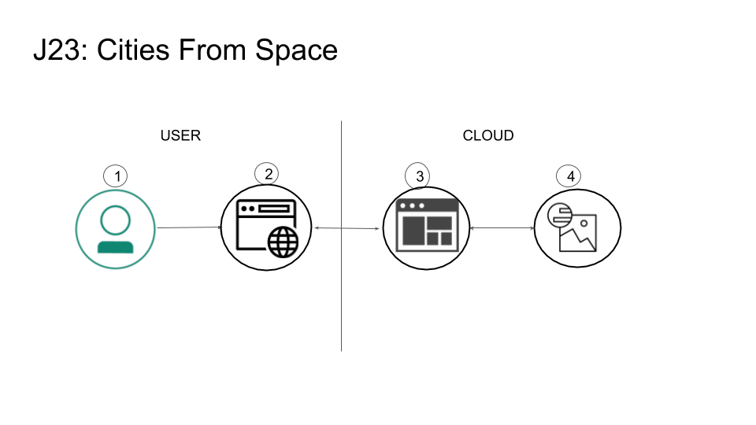
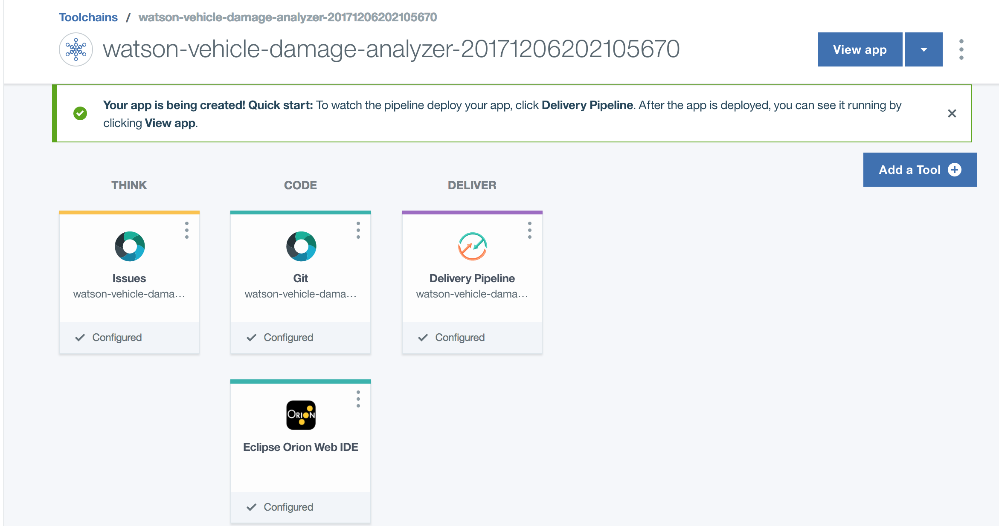
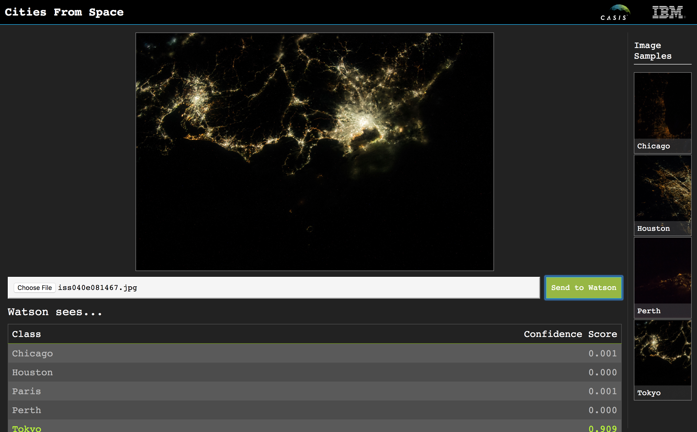
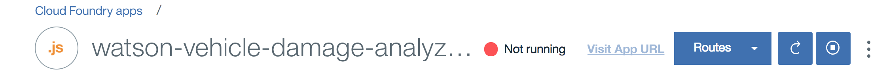

[](https://travis-ci.org/IBM/cities-from-space)

# Identify cities from space

The International Space Station (ISS), launched in 1998, [serves as a microgravity and space environment research laboratory in which crew members conduct experiments in biology, human biology, physics, astronomy, meteorology, and other fields.](https://en.wikipedia.org/wiki/International_Space_Station). These experiments have produced copious amounts of data ane experimental results, many of which are available to the public. [Windows on Earth](https://www.windowsonearth.org/) showcases images taken from the ISS, and are some of the most popular. We will use images of cities at night in this Code Pattern to build a Visual Recognition custom classifier using IBM Watson [Visual Recognition](https://www.ibm.com/watson/services/visual-recognition/). There are thousands of images created by the ISS, and using AI we can help to categorize and organize these images.

When the reader has completed this Code Pattern, they will understand how to:

* Utilize images from the International Space Station to train a Visual Recognition custom classifier.
* Create a Node.js server that can utilize the Watson Visual Recognition service for classifying images.
* Have a server initialize a Visual Recognition custom classifier at startup.
* Demonstrate how to classify images of cities from space using Watson Visual Recognition.



## Flow

1. User interacts with the web UI and chooses an image of a city at night, as viewed from space.
2. The image is passed to the server application running in the cloud.
3. The server sends the image to Watson Visual Recognition Service for analysis.
4. Visual Recognition service classifies the image and returns the information to the server, indicating the confidence level that the image is of a particular city.

## Included components

* [Watson Visual Recognition](https://www.ibm.com/watson/services/visual-recognition/): Visual Recognition understands the contents of images - tag images, find human faces, approximate age and gender, and find similar images in a collection.

## Featured Technologies

* [Node.js](https://nodejs.org/): An asynchronous event driven JavaScript runtime, designed to build scalable applications.

<!--
# Watch the Video
-->

# Steps

> NOTE: The Watson Visual Recognition service required for this patten only exists in the Dallas region (as of 12/14/18). You will only be able to deploy and/or use this code there.

This code pattern contains several pieces. The app server communicates with the Watson Visual Recognition service. The web application is built locally and run in a browser, or accessible on the web server at the same URL. You can deploy the server application using the IBM Cloud, or locally on your machine.
Note that when you first run the server app approximately 125M of image files will be downloaded to the server/data/ directory. These will be used to train the custom classifier.

## Deploy the server application to IBM Cloud

[](https://cloud.ibm.com/devops/setup/deploy?repository=https://github.com/IBM/cities-from-space)

Press the above ``Deploy to IBM Cloud`` button and then click on ``Deploy``.

To monitor the deployment, in Toolchains click on `Delivery Pipeline`  and view the logs while the apps is being deployed.



To see the app and services created and configured for this code pattern, use the IBM Cloud dashboard. The app is named `cities-from-space` with a unique suffix. The following services are created and easily identified by the `cfs-` prefix:
    * cfs-visual-recognition

Once deployed, jump to [step #5](#5-use-the-application-from-a-browser) to test.

## Deploy the server application locally

Perform steps 1-4:

1. [Clone the repo](#1-clone-the-repo)
2. [Create the Watson Visual Recognition service](#2-create-the-watson-visual-recognition-service)
3. [Add Visual Recoginition API key to .env file](#3-add-visual-recoginition-api-key-to-env-file)
4. [Install dependencies and run server](#4-install-dependencies-and-run-server)

## 1. Clone the repo

Clone the `cities-from-space` repo locally. In a terminal, run:

```
$ git clone https://github.com/IBM/cities-from-space
$ cd cities-from-space
```

## 2. Create the Watson Visual Recognition service

Create a Watson Visual Recognition service using IBM Cloud or Watson Studio, a free `lite` plan and a `Standard` plan is available for both. Ensure the service is named `wvda-visual-recognition`.

* [**Watson Visual Recognition on Watson Studio**](https://dataplatform.cloud.ibm.com)

Under the top bar `Services` -> `Watson services` click `+ Add service` and choose `Visual Recognition`

OR

* [**Watson Visual Recognition on IBM Cloud**](https://cloud.ibm.com/catalog/services/visual-recognition)

## 3. Add Visual Recoginition API key to .env file

To use the Visual Recognition service you will need the IAM apikey.

To retrieve the key in Watson Studio, scroll down to the list of `Visual Recognition` services,
find the service you've created and click on the name.

Go to the `Credentials` tab and click `Show credential` for existing creds of `New credential +` if necessary.


In IBM Cloud it will look like this:


Rename the ``cities-from-space/server/env.example`` file to ``cities-from-space/server/.env`` and add the apikey:

```bash
# Watson Visual Recognition
VISUAL_RECOGNITION_IAM_APIKEY=<add_apikey>
```

## 4. Install dependencies and run server

#### If you used the Deploy to IBM Cloud button...

If you used ``Deploy to IBM Cloud``, the setup is automatic.

#### If you decided to run the app locally...

* Install [Node.js and npm](https://nodejs.org/en/download/) (`node` version 6.9.0 or higher)

* Install the app dependencies and start the app:

```bash
cd server
npm install
npm start
```

> Note that the first time that you run the app, it will download >100M of training data to the `server/data` directory, then it will create the custom classifier using that data, which will take several minutes to complete.

## 5. Use the application from a browser

In order to classifier images of cities from space, you can point a browser to the server and test the application.

* For a server running locally, open a browser tab to `localhost:<port>`.
The default port is `3000`
* For a server running on IBM Cloud, open a browser tab and point it to the URL for your server `<IBM_Cloud_server_URL>`

You can then upload a local picture, i.e one from this repository in `test/data/`, or choose
one of the `Image Samples` from the browser window.

# Sample Output

Here's a sample using an image of Tokyo at night:



# Troubleshooting

* Test the Visual Recognition service using the instructions in [test/README.md](test/README.md)

* Error: Server error, status code: 502, error code: 10001, message: Service broker error: {"description"=>"Only one free key is allowed per organization. Contact your organization owner to obtain the key."}

> Only one free key is allowed per organization. Binding the service to an application triggers a process that tries to allocate a new key, which will get rejected. If you already have an instance of Visual Recognition and an associated key, you can bind that instance to your application or update the API key in your server code to tell the app which key to use.

* Deploy or Dashboard shows app is not running

> You may see logs in the Deploy Stage that indicate that the app has crashed and cannot start:

```
Starting app cities-from-space-20171206202105670 in org scott.dangelo / space dev as scott.dangelo@ibm.com...

0 of 1 instances running, 1 starting
0 of 1 instances running, 1 starting
0 of 1 instances running, 1 starting
0 of 1 instances running, 1 starting
0 of 1 instances running, 1 starting
0 of 1 instances running, 1 starting
0 of 1 instances running, 1 starting
0 of 1 instances running, 1 starting
0 of 1 instances running, 1 crashed
FAILED
Error restarting application: Start unsuccessful

TIP: use 'cf logs cities-from-space-20171206202105670 --recent' for more information

Finished: FAILED
```

> OR you may see in the IBM Cloud console that the app is `Not Running`:



> Both of these can be spurious errors. Click the `Visit App URL` link in the IBM Cloud console, or try `Runtime` -> `SSH`, or simply test the app to see if it is running.

# Links

* [Watson Node.js SDK](https://github.com/watson-developer-cloud/node-sdk)

# Learn more

* **Artificial Intelligence Code Patterns**: Enjoyed this Code Pattern? Check out our other [AI Code Patterns](https://developer.ibm.com/technologies/artificial-intelligence/)
* **AI and Data Code Pattern Playlist**: Bookmark our [playlist](https://www.youtube.com/playlist?list=PLzUbsvIyrNfknNewObx5N7uGZ5FKH0Fde) with all of our Code Pattern videos
* **With Watson**: Want to take your Watson app to the next level? Looking to utilize Watson Brand assets? [Join the With Watson program](https://www.ibm.com/watson/with-watson/) to leverage exclusive brand, marketing, and tech resources to amplify and accelerate your Watson embedded commercial solution.

# License

This code pattern is licensed under the Apache Software License, Version 2.  Separate third party code objects invoked within this code pattern are licensed by their respective providers pursuant to their own separate licenses. Contributions are subject to the [Developer Certificate of Origin, Version 1.1 (DCO)](https://developercertificate.org/) and the [Apache Software License, Version 2](https://www.apache.org/licenses/LICENSE-2.0.txt).

[Apache Software License (ASL) FAQ](https://www.apache.org/foundation/license-faq.html#WhatDoesItMEAN)
